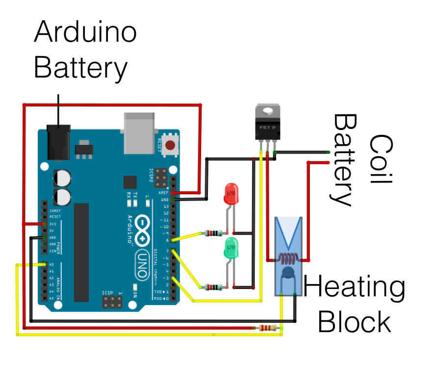

## Prototype Arduino Code

* *Schematic of the Arduino components for the LAMP Shield and their connection on the board.*
* *MOSFET: International Rectifier IRF520NPBF N-channel MOSFET Transistor, 9.7 A, 100 V, 3-pin TO-220AB*
* *Thermistor: EPCOS B57540G1104F Thermistor 100kΩ, 0.8 (Dia.) x 1.4mm*
* *Resistors: 100kΩ for the heat calculation, and two 220Ω resistors for the LED*
* *Heating coil: 5cm Nichrome 0.2mm diameter*

At the moment I'm using a 28BYJ-48 stepper with a modified [Syringe Pump](https://www.thingiverse.com/thing:2797132) by [randomstructures](https://www.thingiverse.com/randomstructures) which Im controlling with FluidicStepper_oneRevolution and FluidicStepper_oneStepAtATime, and controlling temperature using a modified version of the LAMP_SHIELD code from Velders et al. paper [Loop-mediated isothermal amplification (LAMP) shield for Arduino DNA detection](https://dx.plos.org/10.1371/journal.pntd.0007698)

This needs to be combined to single Arduino control and a PIN IN to trigger the sequence
 
